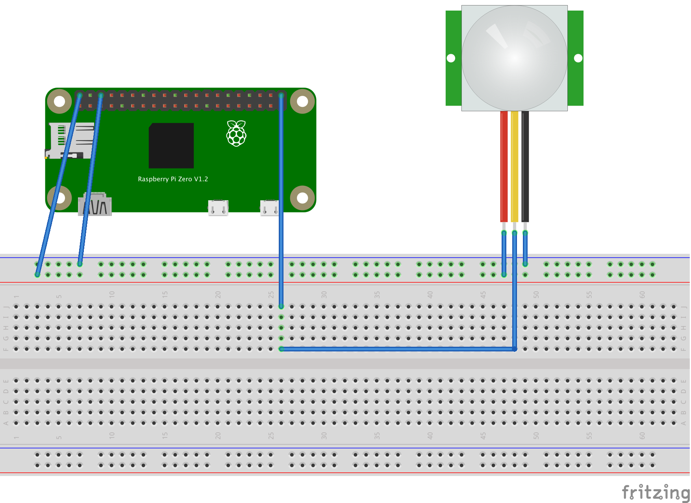

# Connected motion sensor

Detects motion with a [PIR motion sensor](https://learn.adafruit.com/pir-passive-infrared-proximity-motion-sensor/) cabled on a Pi Zero.

Sends an HTTP POST request to a remote server on motion detection.

## Requierements

`$ pip3 install requests`

## Cabling

## Run

`$ python3 connected_motion_sensor/src/main.py`
